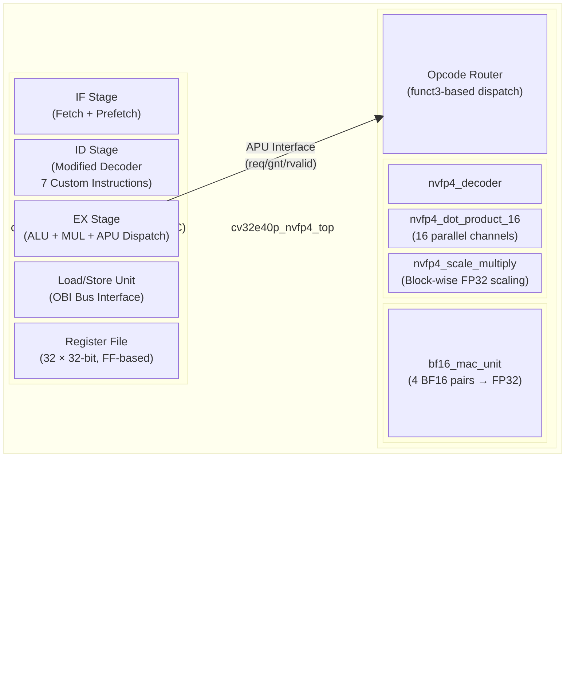
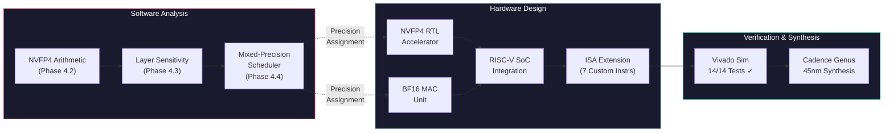
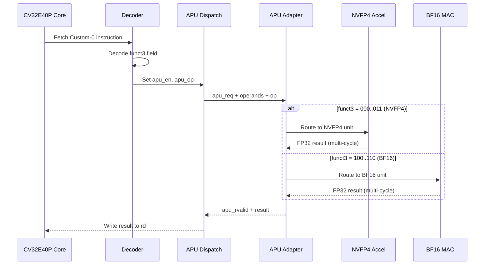

# Mixed-Precision RISC-V Accelerator for Neural Network Inference

A custom RISC-V SoC with hardware-accelerated **NVFP4** and **BF16** dot-product units for mixed-precision DNN inference. Built on the [CV32E40P](https://github.com/openhwgroup/cv32e40p) open-source RISC-V core.

---

## Overview

This project implements a complete mixed-precision inference pipeline — from software analysis to silicon-ready RTL:

1. **NVFP4 Arithmetic Library** — Python implementation of NVIDIA's 4-bit floating-point format with block-wise scaling
2. **Layer Sensitivity Analysis** — Identifies which DNN layers can tolerate aggressive quantization (NVFP4) vs. which need higher precision (BF16)
3. **Mixed-Precision Scheduler** — Assigns optimal precision per layer to minimize accuracy loss while maximizing hardware efficiency
4. **Custom RISC-V ISA Extension** — 7 new instructions added to the CV32E40P decoder for native accelerator dispatch
5. **Hardware Accelerators** — NVFP4 (16-channel) and BF16 (4-channel) dot-product units connected via the APU interface
6. **Full SoC Verification** — 14 test cases (7 NVFP4 + 7 BF16) passing in Vivado behavioral simulation
7. **ASIC Synthesis** — Cadence Genus synthesis scripts targeting GPDK045 (45nm)

---

## Repository Structure

```
mixed-precision-riscv/
│
├── software/                          # Python analysis and scheduling
│   ├── nvfp4_arithmetic/              # Phase 4.2: NVFP4 format implementation
│   │   ├── encode_decode_fp4.py       #   Encode/decode FP4 values
│   │   ├── block_wise_scaling.py      #   Block-wise scale factor computation
│   │   ├── final_quantized.py         #   End-to-end quantization pipeline
│   │   └── ...
│   ├── layer_sensitivity/             # Phase 4.3: Per-layer sensitivity analysis
│   │   ├── nvfp4_utils.py             #   Shared NVFP4/BF16 utilities
│   │   ├── cnn_sensitivity.py         #   CNN layer analysis (MSE, cosine sim)
│   │   ├── mlp_sensitivity.py         #   MLP layer analysis
│   │   ├── transformer_sensitivity.py #   Transformer layer analysis
│   │   ├── resnet20_sensitivity.py    #   ResNet-20 layer analysis
│   │   └── *.log                      #   Analysis results
│   └── mixed_precision_scheduler/     # Phase 4.4: Precision assignment
│       ├── nvfp4_utils.py             #   Extended utilities with BF16 support
│       ├── run_validated_cnn.py        #   CNN scheduler with accuracy validation
│       ├── run_validated_transformer.py
│       ├── run_validated_resnet20.py
│       ├── run_validated_vgg16.py
│       ├── execution_graph_and_latency.py  # Execution graph visualization
│       ├── execution_graphs.png       #   Generated execution graphs
│       ├── latency_analysis.png       #   Latency comparison chart
│       └── logs/                      #   Scheduler output logs
│
├── hardware/                          # SystemVerilog RTL design
│   ├── rtl/
│   │   ├── nvfp4_accelerator/         # NVFP4 dot-product unit (16 channels)
│   │   │   ├── nvfp4_accelerator_top.sv
│   │   │   ├── nvfp4_decoder.sv
│   │   │   ├── nvfp4_dot_product_16.sv
│   │   │   ├── nvfp4_extractor.sv
│   │   │   ├── nvfp4_mac_unit.sv
│   │   │   ├── nvfp4_multiplier.sv
│   │   │   └── nvfp4_scale_multiply.sv
│   │   ├── bf16_mac/                  # BF16 dot-product unit (4 channels)
│   │   │   └── bf16_mac_unit.sv
│   │   ├── apu_adapter/               # APU interface adapter (routes NVFP4/BF16)
│   │   │   └── nvfp4_apu_adapter.sv
│   │   └── soc/                       # SoC integration
│   │       ├── cv32e40p_nvfp4_top.sv  #   CPU + accelerator wrapper
│   │       └── nvfp4_soc_top.sv       #   Full SoC (CPU + RAM + accelerator)
│   ├── cv32e40p_rtl/                  # CV32E40P RISC-V core (modified decoder)
│   ├── cv32e40p_include/              # CV32E40P package files
│   ├── cv32e40p_vendor/               # Clock gate simulation model
│   ├── testbench/                     # Verification testbenches
│   │   ├── tb_nvfp4_full_soc.sv       #   Full SoC testbench (14 tests)
│   │   ├── tb_nvfp4_apu.sv            #   APU-level testbench
│   │   └── tb_nvfp4_accelerator.sv    #   Standalone accelerator testbench
│   └── test_programs/                 # Test program generation
│       ├── generate_multi_test_hex.py #   Generates 14-test assembly program
│       ├── test_nvfp4.hex             #   Assembled test binary (188 instructions)
│       ├── generate_test_vectors.py   #   Standalone accelerator test vectors
│       └── test_vectors.hex           #   Standalone test binary
│
├── synthesis/                         # Cadence Genus ASIC synthesis
│   ├── run_synthesis.tcl              # Main synthesis script
│   ├── constraints.sdc                # Timing constraints (200 MHz target)
│   └── src/                           # Flattened source for synthesis
│       ├── include/                   #   Package files
│       ├── cpu/                       #   CPU RTL
│       ├── accel/                     #   Accelerator RTL
│       └── vendor/                    #   Clock gate model
│
├── docs/                              # Documentation
│   ├── custom_isa_reference.md        # Custom ISA instruction encoding reference
│   └── synthesis_guide.md             # Step-by-step Genus synthesis guide
│
├── README.md                          # This file
├── LICENSE
└── .gitignore
```

---

## Custom ISA Instructions

All 7 instructions use the **RISC-V Custom-0 opcode** (`0x0B`), differentiated by `funct3`:

| Mnemonic        | funct3 | Operation                              |
|:----------------|:------:|:---------------------------------------|
| `NVFP4.LOAD_W`  | `000`  | Load packed NVFP4 weights (16 × 4-bit) |
| `NVFP4.LOAD_A`  | `001`  | Load packed NVFP4 activations          |
| `NVFP4.MAC`     | `010`  | Compute NVFP4 dot-product with scaling |
| `NVFP4.STORE`   | `011`  | Read last stored result                |
| `BF16.LOAD_W`   | `100`  | Load packed BF16 weights (4 × 16-bit)  |
| `BF16.LOAD_A`   | `101`  | Load packed BF16 activations           |
| `BF16.MAC`      | `110`  | Compute BF16 dot-product → FP32 result |

See [docs/custom_isa_reference.md](docs/custom_isa_reference.md) for full encoding details.

---

## Architecture

### SoC Block Diagram



### Project Pipeline



### Data Flow (Instruction Execution)



---

## Verification Results

Simulation on Xilinx Vivado 2022.2 (XSim):

```
CPU finished in 270 cycles.

NVFP4 Results: 7/7 PASS  (16.0, 0.0, 36.0, 9.0, -24.0, 0.25, 576.0)
BF16  Results: 7/7 PASS  (4.0, 14.0, 11.0, 0.0, -10.0, 0.9375, 36.0)

>>> ALL 14 MIXED-PRECISION TESTS PASSED! <<<
```

---

## Quick Start

### Software (Layer Analysis)
```bash
cd software/layer_sensitivity
pip install torch torchvision
python cnn_sensitivity.py        # Run CNN sensitivity analysis
python transformer_sensitivity.py # Run Transformer analysis
```

### Hardware (Vivado Simulation)
1. Create a Vivado project and add all files from `hardware/`
2. Set `tb_nvfp4_full_soc` as the simulation top module
3. Copy `hardware/test_programs/test_nvfp4.hex` to the xsim directory
4. Run behavioral simulation — expect all 14 tests to pass

### Synthesis (Cadence Genus)
```bash
cd synthesis
# Edit run_synthesis.tcl to set your PDK library paths
genus -files run_synthesis.tcl
```

See [docs/synthesis_guide.md](docs/synthesis_guide.md) for detailed instructions.

---

## Technology

- **Processor:** CV32E40P (OpenHW Group, RV32IMC)
- **Custom ISA:** 7 instructions under RISC-V Custom-0 opcode
- **Precision Formats:** NVFP4 (4-bit, block-scaled) + BF16 (16-bit, FP32-compatible)
- **Simulation:** Xilinx Vivado 2022.2
- **Synthesis:** Cadence Genus, GPDK045 (45nm)
- **Language:** SystemVerilog (hardware), Python 3 (software)

---

## Key Files Modified in CV32E40P

Only **one file** in the original CV32E40P RTL was modified:

| File | Change |
|---|---|
| `cv32e40p_decoder.sv` | Added 7 custom instruction cases under `OPCODE_CUSTOM_0` |

All other CV32E40P files are **unmodified**. The integration uses the existing APU interface.

---

## License

This project uses the CV32E40P core licensed under the [Solderpad Hardware License v0.51](http://solderpad.org/licenses/SHL-0.51).
Custom accelerator modules and software are provided under the MIT License.
